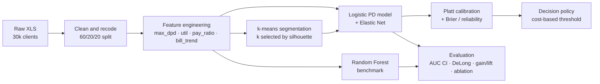

# Credit Default Risk — Customer Segmentation & Probability of Default

> An end-to-end credit-scoring pipeline on the UCI *Default of Credit Card Clients* dataset: behavioural **k-means segmentation**, an interpretable **calibrated logistic PD model**, a **Random Forest** benchmark, and a **cost-based decision policy** — with bootstrap confidence intervals, DeLong tests, calibration analysis and gain/lift curves.

<p align="left">
  
  
  
  
  
  
</p>

---

## TL;DR

Starting from 30,000 credit-card clients, the project (1) engineers repayment-behaviour features, (2) discovers **5 behavioural risk segments** with k-means, (3) trains and **calibrates** a logistic Probability-of-Default (PD) model, (4) benchmarks it against a Random Forest, and (5) turns the scores into an approve/decline rule using an explicit **cost of a missed default vs. a false alarm**.

| Model | AUC (test) | 95% CI | Brier |
|---|---|---|---|
| Logistic regression (calibrated) | **0.754** | 0.739 – 0.770 | 0.143 |
| Random Forest (benchmark) | **0.776** | 0.762 – 0.792 | 0.138 |

The Random Forest is a small but **statistically significant** step up in ranking power (DeLong *p* = 1.4 × 10⁻⁴). The logistic model is kept as the primary model because it is fully interpretable and well-calibrated — the properties a credit function actually needs.

<p align="center">
  
</p>

---

## The problem

For each client we want the **probability they default next month** (`PD`), and then a **decision**: approve or decline. Two things matter beyond raw accuracy:

- **Ranking** — do high-PD customers really default more often? (measured by AUC, gain/lift)
- **Calibration** — when the model says *20%*, do ~20% actually default? (measured by the Brier score and reliability curves)

A model can rank well yet be badly calibrated, so both are evaluated explicitly.

### Dataset

[UCI — Default of Credit Card Clients](https://archive.ics.uci.edu/dataset/350/default+of+credit+card+clients): 30,000 Taiwanese credit-card holders (2005), 23 explanatory variables (credit limit, demographics, 6 months of repayment status `PAY_*`, bill amounts `BILL_AMT*`, and payments `PAY_AMT*`), and a binary target `default payment next month`. The overall default rate is ≈ **22%**. Data is split **60 / 20 / 20** (train / validation / test = 18,000 / 6,000 / 6,000), stratified on the target.

---

## Pipeline at a glance



The repository is organised as a **numbered, reproducible pipeline** — each script consumes the previous stage's output and writes its own artefacts under `data/interim/`, `outputs/` and `reports/figures/`.

| Stage | Scripts | What it does |
|---|---|---|
| **1 · Data** | `01_import_clean_split.r` | Load, recode out-of-range `EDUCATION`/`MARRIAGE`, stratified 60/20/20 split |
| **2 · Features** | `02_features.R` | Engineer behavioural features (see below) |
| **3 · Segmentation** | `02_kmeans_select_and_assign.py`, `01_kmeans_segments.py`, `05_cluster_profile.r`, `05b_k_sensitivity.r` | k-means with k chosen by silhouette + elbow; profile & stress-test the clusters |
| **4 · PD model** | `03_logit_baseline.R`, `03b/03c_logit_regularized*.r`, `03e_logit_refit_with_named_segments.r`, `03d/03e_*` | Logistic regression, Elastic-Net variants, inference (odds ratios, marginal effects), diagnostics |
| **5 · Calibration & policy** | `04_calibrate_threshold.R`, `04_calibration_brier.r`, `04c_threshold_policy.r` | Platt scaling, reliability/Brier decomposition, cost-based threshold |
| **6 · Benchmark & eval** | `07_rf_benchmark.r`, `07b/07c_*`, `04b_auc_bootstrap_delong.r`, `06_ablation_study.r`, `08_deciles_gain_lift.r`, `99_make_executive_summary_tables.R.r` | Random Forest, bootstrap CIs, DeLong test, ablation, gain/lift, executive tables |

---

## Methodology & results

### 1 · Feature engineering

On top of the raw variables, five behavioural features summarise each client's last six months:

| Feature | Meaning |
|---|---|
| `max_dpd` | worst repayment delay observed (max of `PAY_*`) |
| `cnt_dpd` | number of months with a payment delay |
| `util_last` | credit utilisation = latest bill / credit limit (capped) |
| `pay_ratio` | total paid / total billed (capped) |
| `bill_trend` | slope of the bill amount over the 6 months |

### 2 · Customer segmentation (k-means)

Seventeen standardised behavioural features feed a k-means model. The number of clusters is chosen by maximising the **silhouette** score (with the elbow/WCSS curve as a sanity check): **k = 5** wins (silhouette 0.262).

<p align="center">
  
</p>

The five clusters map onto a clean risk ladder, from a **6% default** segment to a **50% default** segment — a 9× spread in risk discovered without ever looking at the target:

<p align="center">
  
</p>

Reading the segments' **behavioural fingerprint** explains *why* each is risky. The *Very high risk* group is defined by delinquency (high `max_dpd` / months late); the *Very low risk* group by consistently large payments (transactors who clear their balance); the *High risk* group carries big revolving balances with a falling bill trend:

<p align="center">
  
</p>

### 3 · Probability of Default — logistic model

A logistic regression on demographics + repayment history + engineered features + segment gives **AUC = 0.754** on the held-out test set. An **Elastic-Net** version (`glmnet`, α swept 0→1) does not beat the plain model (AUC ≈ 0.750 on validation), confirming the baseline is already parsimonious and not over-fit.

The model is fully interpretable — odds ratios with 95% CIs and average marginal effects are exported (`reports/logit_inference_named.csv`, `reports/figures/logit_odds_ratio_forest_named.png`). Recent repayment status (`PAY_0`), the count of late months and utilisation are the strongest upward drivers of default.

### 4 · Calibration

Raw scores are passed through **Platt scaling** fitted on validation. On test, predicted PDs track observed default rates closely across the whole range — the model is trustworthy as a probability, not just a ranking:

<p align="center">
  
</p>

### 5 · From probability to decision

A probability is not a decision. Using an explicit business cost — **a missed default (FN) is 5× as costly as a wrongly declined good client (FP)** — the optimal threshold is calibrated on validation and applied to test:

| Policy | Threshold | Accuracy | Precision | Recall | Specificity | F1 | Balanced acc. |
|---|---|---|---|---|---|---|---|
| Cost-min (FN:FP = 5:1) | ≈ 0.17 | 0.738 | 0.447 | **0.632** | 0.770 | 0.523 | 0.701 |

The low threshold is deliberate: because a missed default hurts 5× more, the policy accepts more false alarms to **catch ~63% of defaulters**. Youden's-J and target-approval-rate policies are also implemented in `04c_threshold_policy.r`.

### 6 · Benchmark & business value

A **Random Forest** (`ranger`, 500 trees) sets a non-linear ceiling: **AUC 0.776** vs 0.754, a gap that is statistically significant (DeLong *p* = 1.4 × 10⁻⁴) but modest in practice, and it needs isotonic post-hoc calibration to match the logit's Brier.

<p align="center">
  
</p>

In business terms, the **gain/lift** curves show what the score buys you: targeting the riskiest **30% of customers captures ~62% of all defaults** (lift ≈ 3× in the top decile):

<p align="center">
  
</p>

---

## Honest findings

- **Segments add interpretability, not much predictive lift.** An ablation (`06_ablation_study.r`) shows that once the raw repayment history is in the model, adding the k-means segment barely moves AUC (0.754 → 0.754). The `PAY_*` variables already carry the delinquency signal. The segments earn their place for **explanation and portfolio action**, not for squeezing out extra AUC — and the report says so rather than overselling them.
- **Random Forest wins on ranking but not for free.** +0.022 AUC is real (DeLong-significant) yet small, and RF's raw probabilities are worse-calibrated than the logit. For a use case that needs defensible, monotone, calibrated PDs, the logistic model remains the sensible primary.
- **The problem is genuinely hard.** An AUC in the mid-0.70s is in line with published results on this dataset — repayment behaviour is informative but far from deterministic.

---

## Reproduce it

**Prerequisites**

- R (≥ 4.0) with: `readxl, dplyr, tidyr, readr, caret, pROC, glmnet, ranger, broom, forcats, ggplot2, scales, stringr, tibble, jsonlite` (plus `isotone` for the optional RF isotonic calibration).
- Python (≥ 3.9) with: `pandas, numpy, scikit-learn, matplotlib, joblib`.
- The dataset `default of credit card clients.xls` from the [UCI page](https://archive.ics.uci.edu/dataset/350/default+of+credit+card+clients).

**Run order** (each step writes into `data/interim/`, `outputs/`, `reports/figures/`):

```bash
# 1 — data & features
Rscript 01_import_clean_split.r          # ← edit the dataset path at the top first
Rscript 02_features.R

# 2 — segmentation (k chosen by silhouette; k = 5)
python3 02_kmeans_select_and_assign.py
Rscript 02b_join_segments.r
Rscript 05_cluster_profile.r

# 3 — logistic PD model + inference
Rscript 03_logit_baseline.R
Rscript 03b_logit_regularized.r
Rscript 03e_logit_refit_with_named_segments.r

# 4 — calibration & decision policy
Rscript 04_calibrate_threshold.R
Rscript 04_calibration_brier.r
Rscript 04c_threshold_policy.r

# 5 — benchmark & evaluation
Rscript 07_rf_benchmark.r
Rscript 06_ablation_study.r
Rscript 04b_auc_bootstrap_delong.r
Rscript 99_make_executive_summary_tables.R.r
```

> **Note.** `01_import_clean_split.r` points to a local path for the `.xls` — change it to wherever you saved the dataset. A few scripts were written to be run in sequence (they expect the previous stage's `data/interim/*.csv` to exist), so keep the order above.

---

## Repository structure

```
ADVANCED-STATISTICS/
├── 01_*  02_*  … 08_*  99_*        # numbered pipeline (R + Python)
├── z_io_helpers.R.r                # shared IO helpers
├── Test_coerenza.r                 # sanity checks on PD / thresholds
├── docs/assets/                    # figures used in this README
├── data/                           # (generated) raw + interim CSVs — gitignored
├── outputs/                        # (generated) metrics, model artifacts, JSON
└── reports/figures/                # (generated) analysis figures
```

---

## Tech stack

**R** — `glmnet`, `ranger`, `caret`, `pROC`, `broom`, `ggplot2` for modelling, inference and evaluation.
**Python** — `scikit-learn` (k-means, silhouette), `pandas`, `matplotlib` for segmentation and visualisation.
A deliberately **polyglot** design: Python for clustering, R for statistical modelling and inference.

---

## License

Released under the MIT License — see [`LICENSE`](LICENSE).

## Author

**Daniele Giovanardi** · [GitHub](https://github.com/DanieleGiovanardi2408)

<sub>Dataset: Yeh, I. C., & Lien, C. H. (2009). *The comparisons of data mining techniques for the predictive accuracy of probability of default of credit card clients.* Expert Systems with Applications.</sub>
